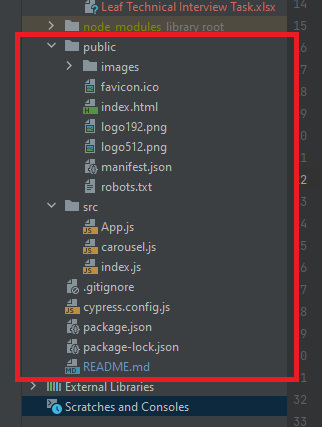

# PROJECT SUMMARY
* This project developed for react leaf infinite carousel integration test,
* **[React Leaf Carousel](https://www.npmjs.com/package/react-leaf-carousel)** example code repository used as base code,
* To details of Assessment, can access **[here](https://leafgrow.notion.site/Assessments-ab206e55432940d6a07924cd7e3b9761)**
* ### Using Tools
    * **[Cypress.io](https://www.cypress.io/)** used for test,
    * **[React Leaf Carousel](https://www.npmjs.com/package/react-leaf-carousel)** example code repository,
    * **[Chrome Browser v102](https://support.google.com/chrome/answer/95346?hl=en&co=GENIE.Platform%3DDesktop)** used for test,
    * **[Node.js v16.15.1](https://nodejs.org/en/download/)**,
    * **[WebStorm](https://www.jetbrains.com/webstorm/promo/?source=google&medium=cpc&campaign=9641686233&term=webstorm&gclid=CjwKCAjw46CVBhB1EiwAgy6M4skNd4L7UjCdqpp41lo61c6fCTwrKcDa5FxsPrCOhiGxaikgxnOb6RoCcJEQAvD_BwE)**
    * **[VSCode](https://code.visualstudio.com/download)** used as IDE,

* React Project Created
* Project support multi OS
* Project support different browsers (except IE and Safari)

# SUMMARY OF STRUCTURE
* Project contain 3 different part
  * First part manuel test cases part
    * 
  * Second Cypress Integration Tests
    * 
  * Third infinite carousel app
    * 

# TEST EXECUTION
* Pre Conditions of execution;
  * Node.js, browser, IDE must be installed,
* Open project in IDE and type to terminal following code order by
  ```
  npm init
  ```
  ```
  npm start
  ```
    * Open new terminal and provide following codes order by(don't stop previous one)
  ```
  npm install cypress --save-dev
  ```
  ```
  npx cypress open
  ```
    * Then cypress suite will open. Select the 'testFile.spec.cy.js' file for run.
    * Additional of Cypress suite, you can start the test run from terminal
    * For terminal usage, after 'npm start' code provide followings code. Then test run will start browser headless
  ```
  npm test
  ```
  

### Developed by Cihan Aslan
### cihan.aslan.qa@gmail.com